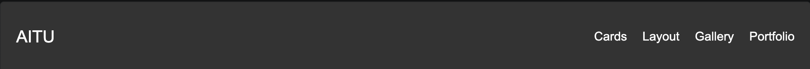
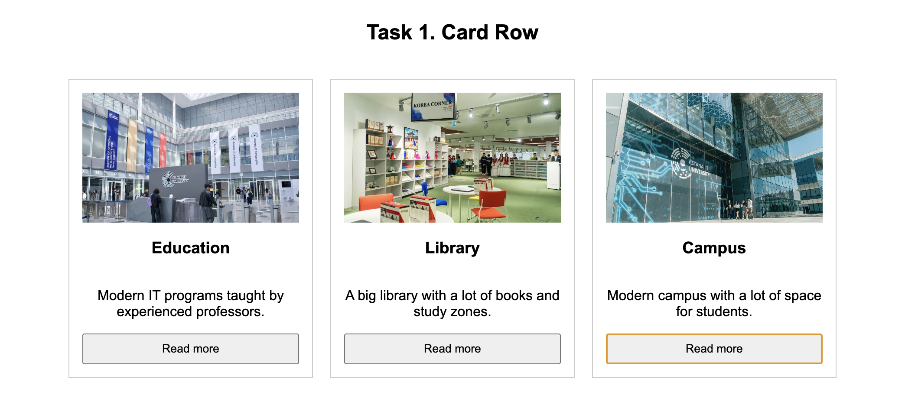
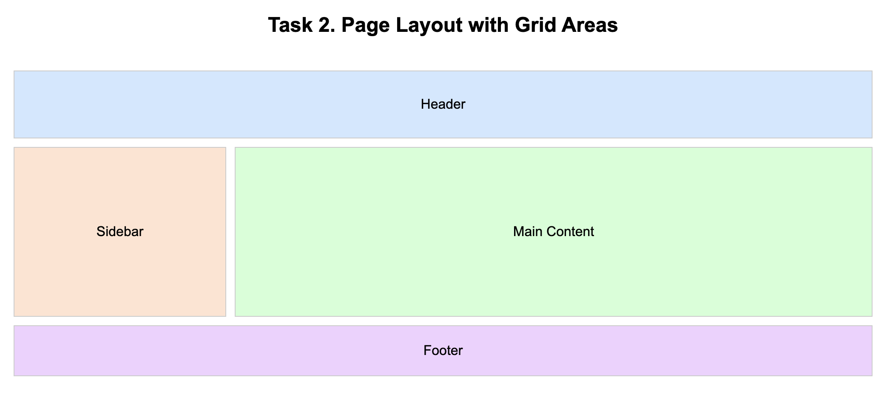
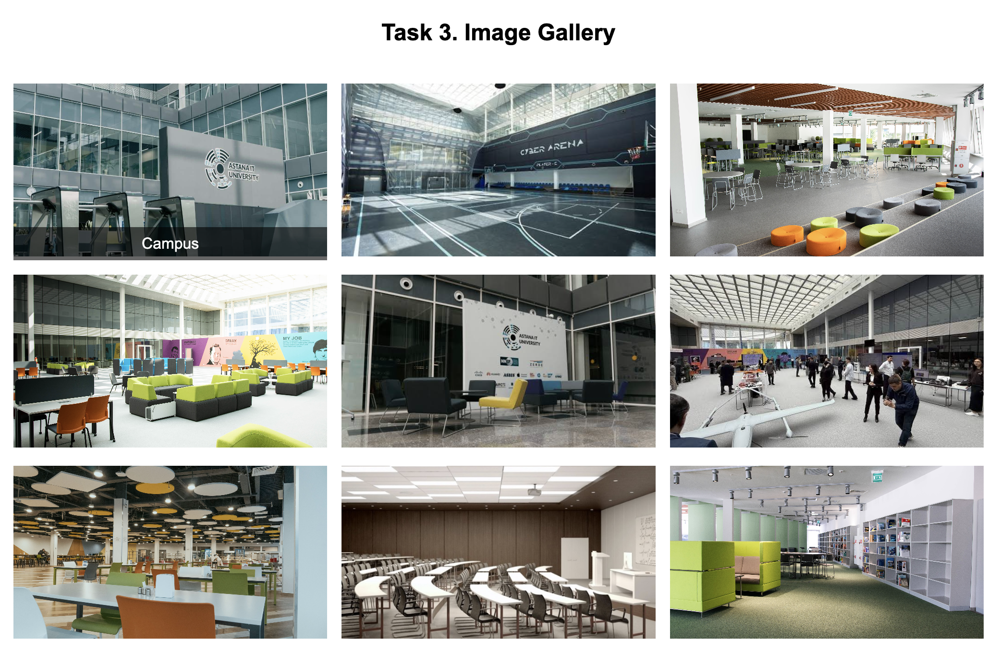
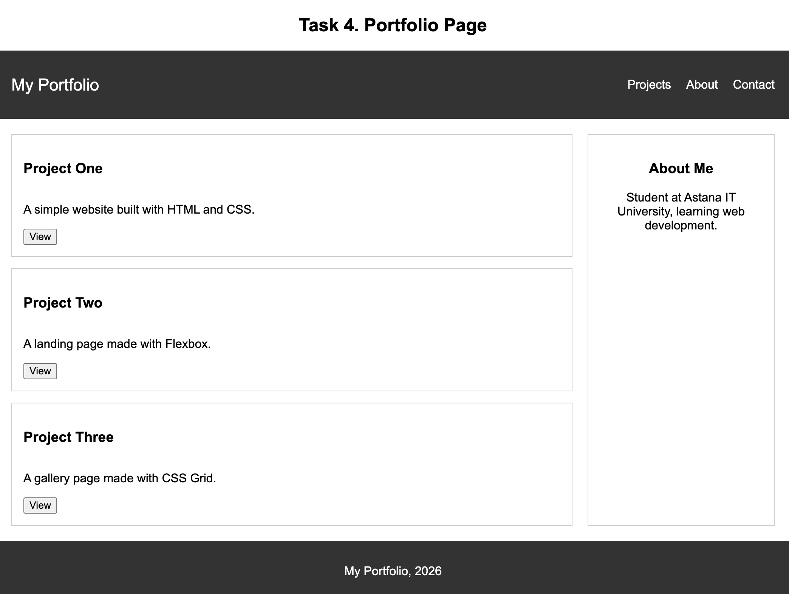

# Assignment #2. Advanced CSS (Flexbox & Grid)

Name: Azamat Merzemkhan
Group: IT-2513

## Task 0. Navigation Bar

The header is a flex container. The logo is on the left and the links are on the right. The links have space between them and are centered vertically.

## Task 1. Card Row

The card container is a flex container with three cards in a row. Each card has an image, title, text and a button. All cards have equal height and equal gaps. A hover effect (shadow) is added.

## Task 2. Page Layout with Grid Areas

The layout container is a grid container with grid-template-areas. It has a header on top, a sidebar on the left, main content on the right, and a footer on the bottom.

## Task 3. Image Gallery

The gallery has nine images placed in a grid with three equal columns. There are gaps between the images. When the mouse is over an image, a caption appears.

## Task 4. Portfolio Page

The portfolio page has a header, main section, sidebar and footer. The header uses Flexbox for the navigation. The main section uses Grid, with projects on the left and info on the right. Each project card uses Flexbox to arrange the title, text and button. The footer is at the bottom of the page.

## Summary

In this assignment I practiced Flexbox and CSS Grid. I made a navigation bar, a row of cards, a page layout with grid areas, an image gallery, and a portfolio page. Flexbox was used for one-direction layouts like the navbar and cards. Grid was used for two-direction layouts like the page structure and gallery. In the portfolio page I combined both Flexbox and Grid together.# web2
